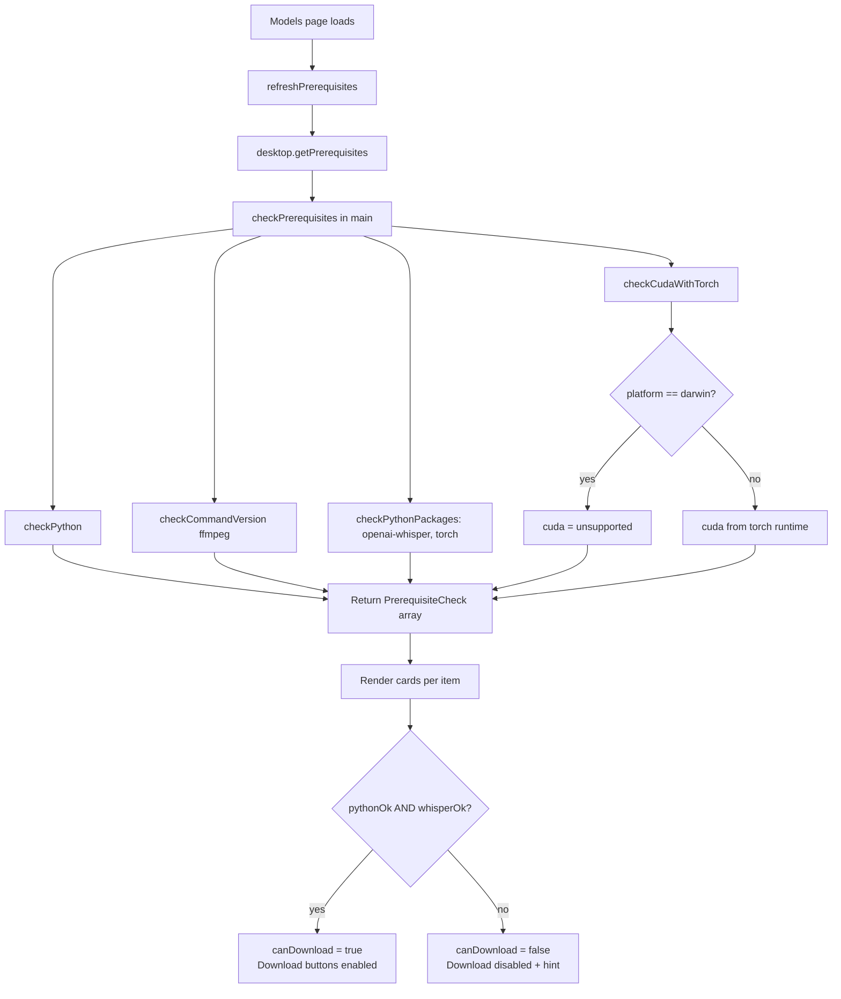
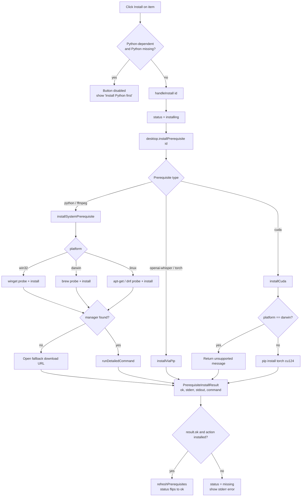

# Architecture

Whisper Studio Desktop uses a process-first architecture. Each runtime has a clear job and communicates through typed contracts.

## Process Overview

```
┌─────────────────────────────────────────────────────────────┐
│  Renderer (React + Vite)                                    │
│  src/renderer/src                                           │
│                                                             │
│  features/  ──►  lib/  ──►  window.desktop (DesktopApi)     │
└────────────────────────┬────────────────────────────────────┘
                         │  contextBridge (context-isolated)
┌────────────────────────▼────────────────────────────────────┐
│  Preload  (src/preload/index.ts)                            │
│  Exposes DesktopApi via contextBridge.exposeInMainWorld     │
└────────────────────────┬────────────────────────────────────┘
                         │  ipcRenderer.invoke / ipcRenderer.on
┌────────────────────────▼────────────────────────────────────┐
│  Main Process  (src/main)                                   │
│                                                             │
│  ipc/system/  ──  ipc/whisper/  ──  Native Node APIs        │
│  (handlers)        (handlers)       (fs, dialog, spawn)     │
└─────────────────────────────────────────────────────────────┘
```

## Data Flow: Full Transcription

```
User picks a file (NewTranscription)
  │
  ▼  IPC: whisper:select-file
Main → dialog.showOpenDialog()
  │  returns { filePath, fileName }
  ▼
Renderer builds TranscriptionFile (reads metadata locally)
User configures model, language, output formats
  │
  ▼  IPC: whisper:transcribe
Main spawns whisper CLI child process
  │  streams stdout/stderr via whisper:output-chunk events
  │  emits phase changes via whisper:progress-update events
  │  on exit: parses JSON output, builds TranscriptionRecord
  │  writes metadata to whisper-studio.json
  │  returns WhisperTranscriptionResult
  ▼
Renderer stores record via setStudioRecord()
Navigates to /studio
  │
  ▼
Studio loads record from studio-store, displays transcript editor
User edits segments → useSegmentSave → IPC: fs:write-text-file
  │
  ▼
Export feature reads record from studio-store
Generates content via export-generators (SRT / VTT / TXT / TSV)
Saves via IPC: fs:write-text-file
```

## Data Flow: Prerequisites & Model Gating

The Models page checks system prerequisites, installs missing ones via the
platform's package manager, and gates model downloads until Python and
`openai-whisper` are present.

### Check & gating flow



### Per-item install action



### System install result resolution

```mermaid
sequenceDiagram
    participant UI as Prerequisites UI
    participant Main as installSystemPrerequisite
    participant PM as Package manager
    participant Shell as Browser

    UI->>Main: installPrerequisite(ffmpeg)
    Main->>PM: probe (winget/brew/apt --version)
    alt manager available
        Main->>PM: run install command
        PM-->>Main: exitCode, stdout, stderr
        Main-->>UI: { ok, stdout, stderr, command }
    else no manager
        Main->>Shell: openExternal(fallback URL)
        Main-->>UI: { action: opened, ok: true }
    end
    UI->>UI: ok -> refresh; else show error
```

## IPC Channel Namespaces

All IPC channel names are constants in `src/shared/ipc.ts` under `IPC_CHANNELS`. They follow a `namespace:action` convention:

| Namespace         | Purpose                                        |
| ----------------- | ---------------------------------------------- |
| `app:`            | Application metadata (name, version, runtime)  |
| `system:`         | Platform, prerequisites, system status         |
| `models:`         | Whisper model download, list, delete, progress |
| `window:`         | Minimize, maximize, close, state change events |
| `whisper:`        | File selection, transcription, progress events |
| `transcriptions:` | List and delete saved transcription records    |
| `fs:`             | Read file, write file, select directory        |

## Pending-Record Handoff Pattern

`src/renderer/src/lib/studio-store.ts` holds a single mutable slot used to pass a `TranscriptionRecord` from the `new-transcription` feature to the `studio` feature across a navigation event. The caller sets the record with `setStudioRecord()` immediately before navigating to `/studio`; the Studio component consumes and clears it with `takeStudioRecord()` on mount.

This pattern avoids encoding the full record in the URL. It is intentionally simple because only one transcription can be active at a time.

## Main Process

`src/main` owns privileged desktop behavior:

- Application lifecycle
- Native windows
- Application menus
- External links
- IPC handlers
- Future integrations such as file system access, auto-updates, and native dialogs

Renderer code should not import from `src/main`.

### IPC Handler Organization

Handlers are grouped by domain under `src/main/ipc/`:

```
ipc/
├── system.ts          ← barrel: registers all system handlers
├── system/
│   ├── cache.ts       ← time-scoped deduplicating cache utility
│   ├── model-cache.ts ← cached model list
│   ├── prerequisites.ts ← dependency version checks
│   ├── status.ts      ← system status metrics
│   └── window-controls.ts ← window state helpers
└── whisper/
    ├── index.ts       ← barrel: registers all whisper handlers
    ├── executor.ts    ← spawns whisper CLI child process
    ├── parser.ts      ← parses whisper JSON/SRT output
    └── utils.ts       ← path and format helpers
```

## Preload

`src/preload` is the only bridge between Electron and React. It exposes a narrow API through `contextBridge` while `contextIsolation`, `sandbox`, and `nodeIntegration: false` remain enabled.

Add new renderer-facing capabilities by:

1. Defining request and response types in `src/shared`.
2. Registering an IPC handler in `src/main/ipc`.
3. Exposing a small function from `src/preload`.
4. Calling that function from React.

## Renderer

`src/renderer` owns UI and product workflows. It is organized around a workbench shell:

- `components` for reusable layout and controls
- `features` for product-specific screens, each self-contained
- `lib` for renderer-only data and helpers

Keep OS access out of this layer. Use `window.desktop` for native capabilities.

### Feature Folder Conventions

Each feature under `src/renderer/src/features/<name>/` follows this structure:

```
<name>/
├── index.tsx          ← feature root component (default export)
├── components/        ← components used only by this feature
└── hooks/             ← hooks used only by this feature
```

## Shared Contracts

`src/shared` contains IPC channel names and TypeScript interfaces used by more than one process. Keep this layer dependency-free so it can be imported anywhere.

Key files:

- `ipc.ts` — `IPC_CHANNELS` constant, all request/response types, and the desktop API interfaces (see below)
- `types.ts` — `Result<T, E>` discriminated union for operations that can succeed or fail, plus `ok()` and `err()` helpers
- `errors.ts` — typed error classes (`TranscriptionError`, `ModelError`, `PrerequisiteError`)
- `constants.ts` — application-wide constants shared across processes

### Desktop API Interfaces (ISP)

`DesktopApi` is composed from five focused sub-interfaces. Components declare only what they need:

| Interface           | Methods                                                                                                                           | Used by                                                    |
| ------------------- | --------------------------------------------------------------------------------------------------------------------------------- | ---------------------------------------------------------- |
| `AppApi`            | `getAppInfo`, `getPlatform`, `getSystemStatus`, `getPrerequisites`, `installPrerequisite`, `getFilePath`                          | `use-desktop-shell`, `files-step`, `prerequisites`         |
| `ModelApi`          | `getDownloadedModels`, `downloadModel`, `deleteModel`, `onModelDownloadProgress`                                                  | `models/`                                                  |
| `TranscriptionApi`  | `selectWhisperFile`, `transcribeWithWhisper`, `onWhisperOutput`, `onWhisperProgress`, `listTranscriptions`, `deleteTranscription` | `new-transcription/`, `dashboard/`                         |
| `FileSystemApi`     | `readTextFile`, `writeTextFile`, `selectDirectory`                                                                                | `studio/`, `export/`                                       |
| `WindowControlsApi` | `windowControls.*`                                                                                                                | `use-desktop-shell`                                        |
| `DesktopApi`        | all of the above (intersection type)                                                                                              | `app-route-view`, `lib/desktop.ts`, `preload/`, `env.d.ts` |

### Result Type

Use `Result<T, E>` from `src/shared/types.ts` for operations that can fail without throwing:

```typescript
import { type Result, ok, err } from '@shared/types'

function parse(raw: string): Result<Parsed, TranscriptionError> {
  try {
    return ok(JSON.parse(raw))
  } catch (e) {
    return err(new TranscriptionError('parse failed', null, String(e)))
  }
}
```

## Packaging

Electron Builder reads release settings from `package.json`. Generated artifacts are written to `release/`, while compiled app code is written to `out/`.

Before a public release, add:

- Real application icons in `resources/`
- macOS signing and notarization
- Windows code signing
- Auto-update configuration
- CI release jobs with protected secrets
