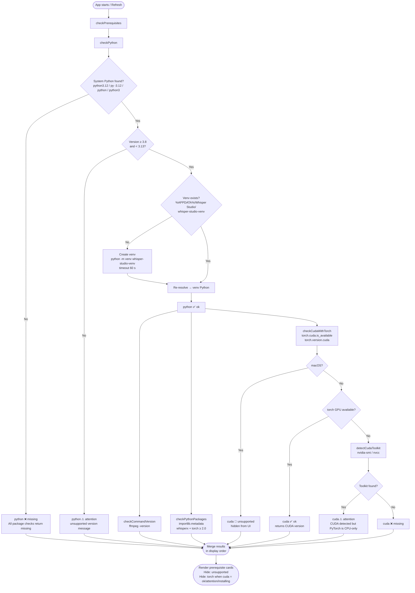
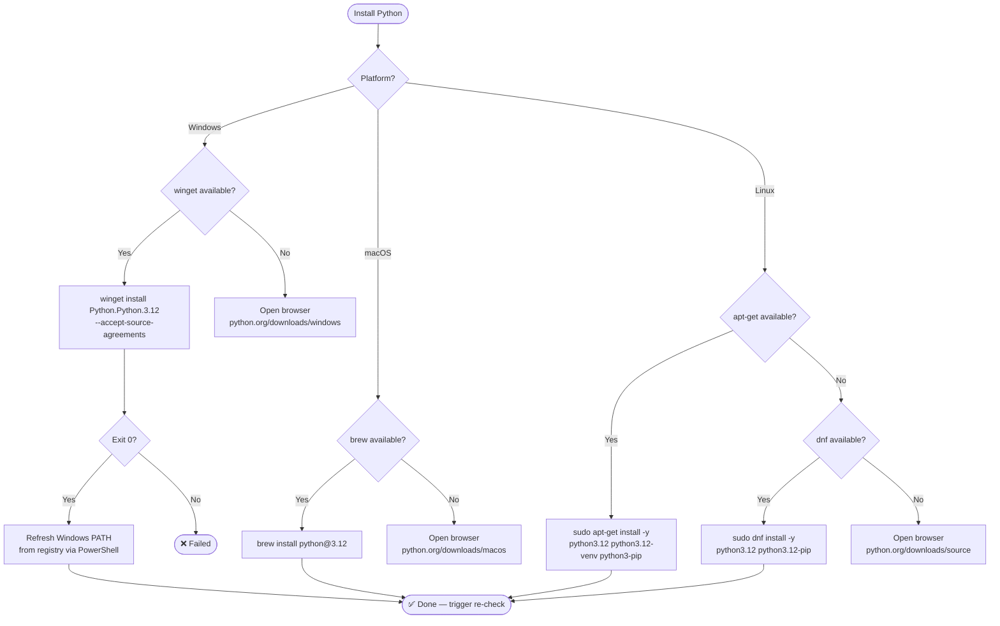
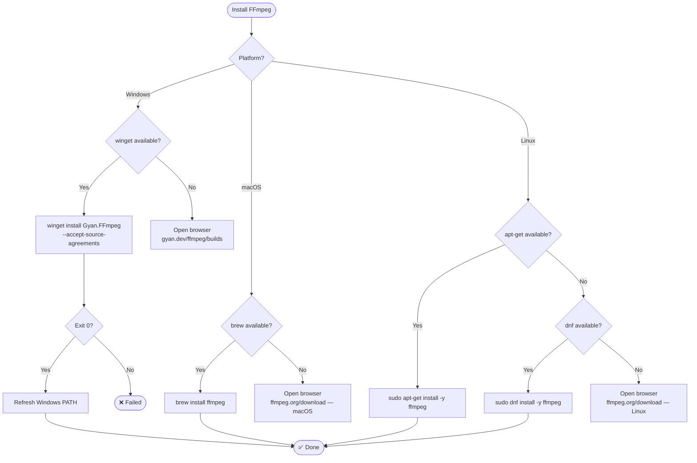
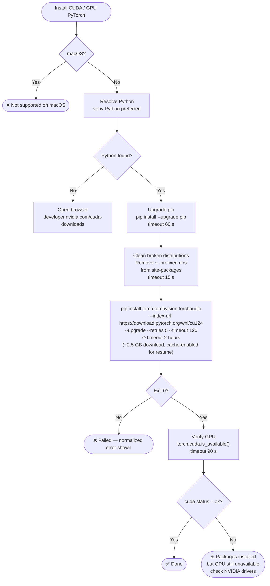
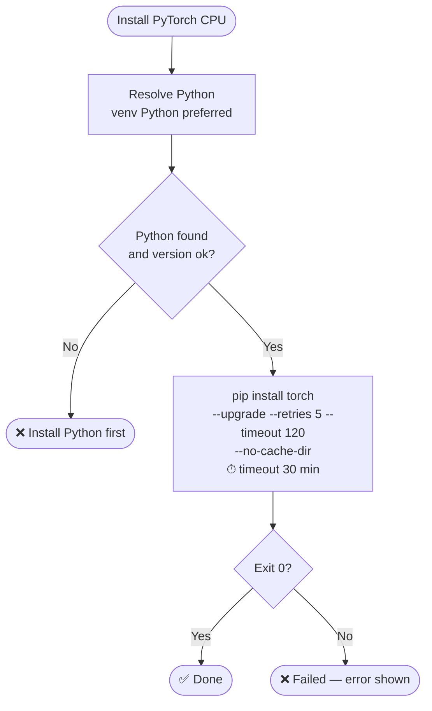
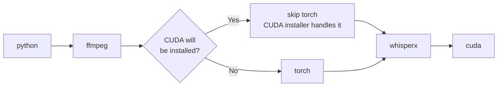
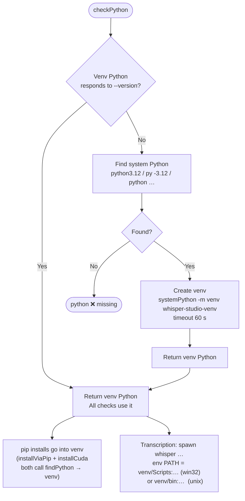

# Prerequisites Flow

Whisper Studio checks and installs five prerequisites before transcription is available.
This document describes the full check and install pipeline across all supported platforms.

---

## 1 · Check Pipeline

Every time the Models page is opened (or refreshed), the app runs all checks in parallel after resolving Python.

---

## 2 · Install Pipeline — per prerequisite

### 2a · Python

### 2b · FFmpeg

### 2c · CUDA + PyTorch (GPU)

> This installer handles **torch, torchvision, and torchaudio** together.
> The standalone PyTorch card is hidden from the UI when CUDA is detected.

### 2d · whisperx

### 2e · PyTorch CPU (shown only when CUDA is unsupported / missing)

---

## 3 · Fix All Order

When the user clicks **Fix All**, prerequisites are installed sequentially in dependency order:

> **CUDA will be installed** when `cuda.status` is `missing` or `attention` (hardware detected).

---

## 4 · Venv Isolation

All package installs and the `whisper` CLI run inside an app-managed venv, isolated from the user's system Python.

| Platform | Venv location                                                      |
| -------- | ------------------------------------------------------------------ |
| Windows  | `%APPDATA%\Whisper Studio\whisper-studio-venv`                     |
| macOS    | `~/Library/Application Support/Whisper Studio/whisper-studio-venv` |
| Linux    | `~/.config/Whisper Studio/whisper-studio-venv`                     |
